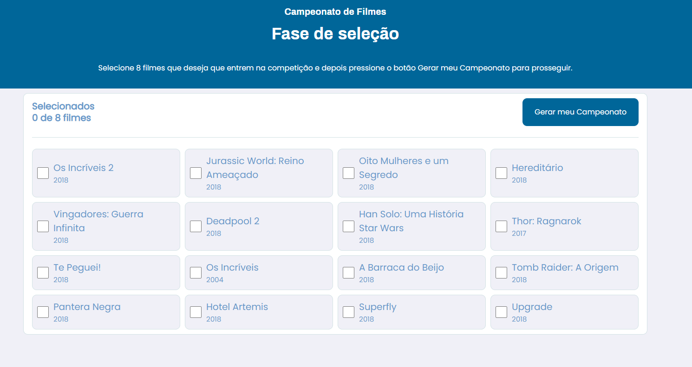

# 🏆 Copa Filmes 🏆


## 🚀 Tecnologias
Esse projeto foi desenvolvido com as seguintes tecnologias:
- React
- AspNetCore

## 💻 Projeto
Projeto web responsivo criado com intuito de realizar uma Copa do Mundo de filmes, e determinar quais filmes estarão no pódio e quem é o grande campeão. A copa é realizada entre os 8 filmes selecionados pelo usuário e resultado de cada partida é determinado de acordo com a nota do público para cada um dos filmes.

### Pré-requisitos
Antes de começar, você vai precisar ter instalado em sua máquina as seguintes ferramentas:
[Git](https://git-scm.com), [Node.js](https://nodejs.org/en/). 
Além disto é bom ter um editor para trabalhar com o código como [VSCode](https://code.visualstudio.com/) ou [Visual Studio 2019 Community](https://visualstudio.microsoft.com/pt-br/vs/community/)

## 🎲 Rodando o projeto

### 1. Clone este repositório
```bash
$ git clone <https://github.com/MarceloCorreaADS/CopaFilmes.git>
```
### 2. Acesse a pasta do projeto no terminal/cmd
```bash
$ cd CopaFilmes
```

### 3. Rodando o Back-end (Servidor)
1. Vá para a pasta do back-end
```bash
$ cd backend
```
2. Build a solution usando Visual Studio ou no terminal usando
```bash
$ dotnet build
```
3. Rode o projeto usando Visual Studio ou no terminal usando 
```bash
$ dotnet run
```
4. O projeto está configurado para abrir em [http://localhost:3333](http://localhost:3333) ou [https://localhost:3334](https://localhost:3334)
5.Use o HTTP client com [Insomnia](https://insomnia.rest/download/) ou [Postman](https://www.postman.com/)

### 4. Rodando o Front-end (Web)
1. Volte para a pasta raiz e acesse a pasta do front-end
```bash
$ cd ..\
$ cd web
```
2. Instale as depêndencias
```bash
$ npm install
```
3. Execute a aplicação
```bash
$ npm start
```
4. O front-end está configurado para iniciar em [http://localhost:3000](http://localhost:3000)